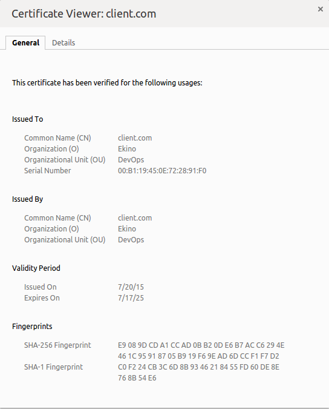
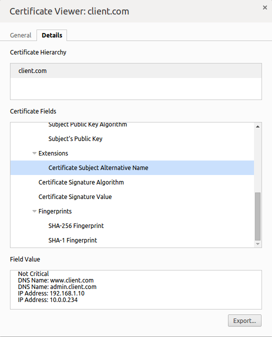

# frntn/x509-san

Generate a self-signed x509v3 certificate for use with multiple URLs / IPs

## Generate

#### Default values

```bash
curl -sSL https://raw.githubusercontent.com/frntn/x509-san/master/gencert.sh | CRT_CN="client.com" CRT_SAN="DNS.1:www.client.com,DNS.2:admin.client.com,IP.1:192.168.1.10,IP.2:10.0.0.234" bash
```

#### Custom values

Simply **change the `CRT_CN` and `CRT_SAN` values** of the above command to fit your needs...

Additionally you can use any of these environment variables :
 - `CRT_C` : Country value
 - `CRT_L` : Locality value
 - `CRT_O` : Organization value
 - `CRT_OU` : Organizational Unit value
 - `CRT_CN` : Common Name value
 - `CRT_SAN` : SubjectAltName value

#### Result

The command will generate two files:
 - pkcs#8 private key : `frntn-x509-san.key`
 - x509v3 certificate : `frntn-x509-san.crt`

You can then check the certificate content by using the following standard `x509` command :

```bash
openssl x509 -in frntn-x509-san.crt -noout -text
```

## Secure

The generated private key is passwordless by default. 

You can secure/unsecure using standard `pkcs8` commands :

```bash
# secure
openssl pkcs8 -in frntn-x509-san.key -topk8 -v2 des3 -out frntn-x509-san.secure.key

# unsecure
openssl pkcs8 -in frntn-x509-san.secure.key -topk8 -nocrypt -out frntn-x509-san.key
```

## Screenshots

With the default values, the certificate will look like *(screenshots from Chrome certificate viewer)*:




## Additional Reading

- OpenSSL's Subject Alternative Name [documentation](https://www.openssl.org/docs/apps/x509v3_config.html#Subject-Alternative-Name)
- SubjectAltName page on [wikipedia](https://en.wikipedia.org/wiki/SubjectAltName)
